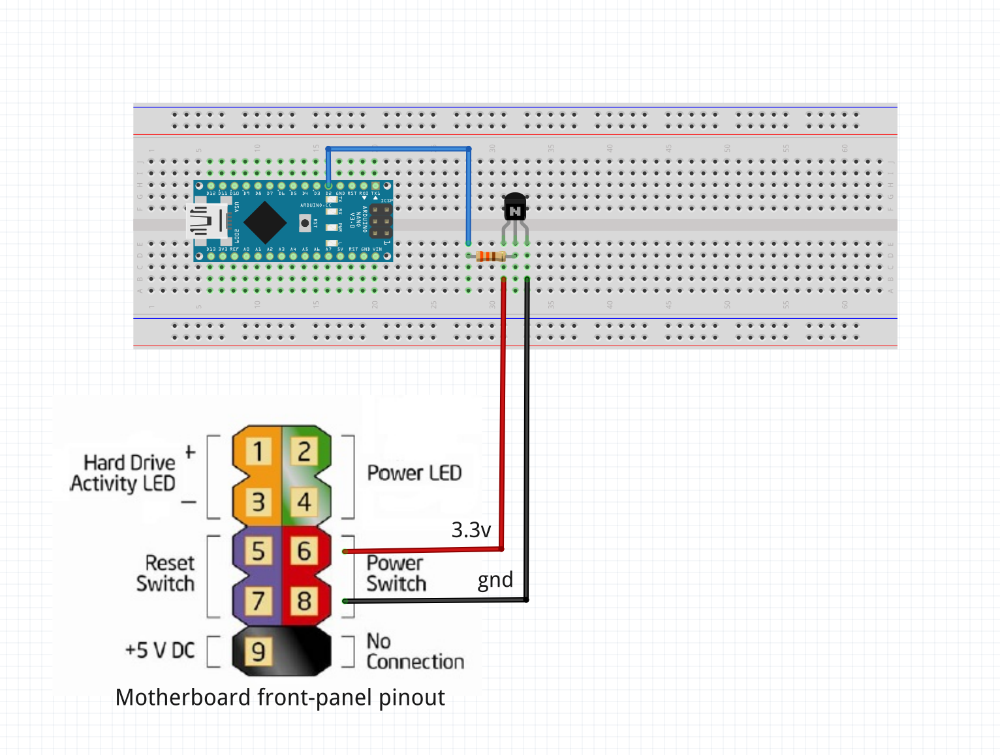

# Projet de switch serveur piloté par Arduino via un service sur le PC central

## Étapes

1. **Téléverser le code** : Ajuster les **pins** de l’Arduino (ici un Nano) et assembler le tout selon le schéma (à faire), shema de l élément essentiel ici, le jeu de led est facultatif est simple a mettre en place. 



2. **Lancer le script Python** :
   ```bash
   python Serial_signal_stray.py

2. **Pérenniser le service** : Assurer la continuité du service en arrière-plan.

## TODO

- **Synchroniser les commandes** : Faire en sorte que les commandes envoyées par le script soient correctement synchronisées avec le client Arduino.
- **Synchroniser les réponses** : Synchroniser les réponses du client Arduino avec le service.
- **Ajouter un buck-boost** : Installer un convertisseur **buck-boost** pour compenser la perte de tension induite par la LED (jaune, -0.7V) sur le **transistor de commutation**, ou passer la LED en parallèle.
- **Imprimer une case en 3D** : Conception et impression d'un boîtier pour l'assemblage.
